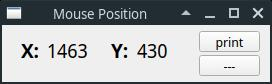

Show Mouse Position
===================

A little GUI tool that shows the current mouse position.

Motivation
----------

I made this tool to facilitate work with [pyautogui](https://github.com/asweigart/pyautogui).

Screenshots
-----------




The idea is to let it run in a corner and read the mouse position when needed.

Usage
-----

Start it in a terminal because it can print the mouse position
to the standard output.

The program has the following shortcuts:

```
Ctrl+H                    this help
Ctrl+Q                    quit
Ctrl+P                    print mouse position on stdout
Ctrl+S, Ctrl+-            print separator on stdout
Ctrl+Enter                print a new line on stdout
Ctrl+L                    clear screen
Ctrl+C                    copy mouse position to clipboard
```

Installation
------------

I used poetry, but you don't have to. Dependencies can be found in `pyproject.toml`.
If you prefer plain `pip`, then create a virtual environment, activate it, and install
the dependencies. Then start `main.py`.
