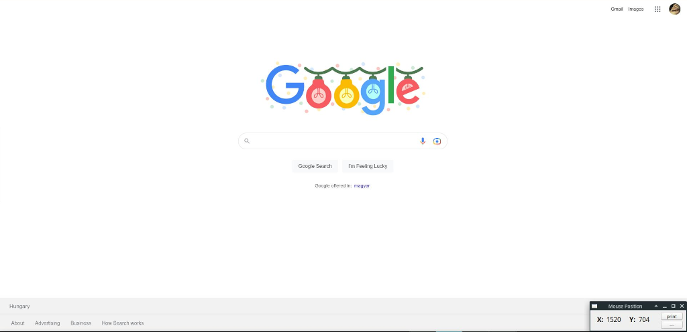

Show Mouse Position
===================

A little GUI tool that shows the current mouse position, i.e. the X any Y coordinates
of your mouse pointer. The coordinates are updated as you move the mouse.

Motivation
----------

I made this tool to facilitate work with [pyautogui](https://github.com/asweigart/pyautogui).

Screenshots
-----------




The idea is to let it run in a corner and read the mouse coordinates when needed.

Usage
-----

Start it in a terminal because it can print the mouse coordinates
to the standard output.

The program has the following shortcuts:

```
Ctrl+H                    this help
Ctrl+Q                    quit
Ctrl+P                    print mouse coordinates on stdout
Ctrl+S, Ctrl+-            print separator on stdout
Ctrl+Enter                print a new line on stdout
Ctrl+L                    clear screen
Ctrl+C                    copy mouse coordinates to clipboard
```

Installation
------------

I used poetry, but you don't have to. Dependencies can be found in `pyproject.toml`.
If you prefer plain `pip`, then create a virtual environment, activate it, and install
the dependencies. Then start `main.py`.

If you want to use poetry but you've never used it, here are the steps (thanks to /u/zom-ponks):

```
pip install poetry -U # if you haven't got it installed yet
git clone https://github.com/jabbalaci/ShowMousePosition
cd ShowMousePosition
poetry install # this will install dependencies and create a venv
poetry run python main.py
```

Supported Platforms
-------------------

I tried it under Linux and Windows, but it should also work on macOS.

Links
-----

* [reddit discussion](https://old.reddit.com/r/Python/comments/zc7ldk/i_made_a_little_gui_tool_that_shows_the_current/)
